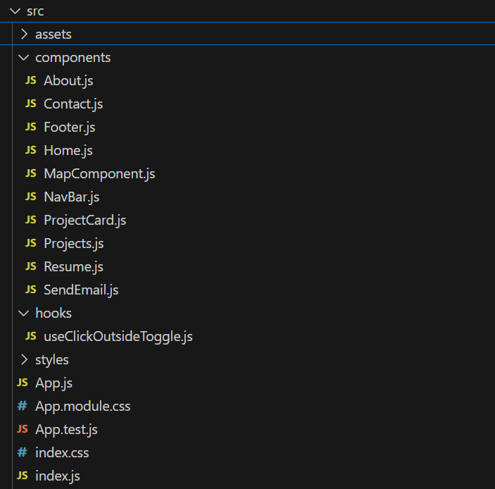

# Milen Tecle Portfolio

This is the source code for my personal portfolio website, showcasing my skills, projects and experience as a Junior Full Stack Software Developer. The site is designed to be responsive, user-friendly and optimized for performance across various devices.

# Live Site
Visit the live site here: [Milen Tecle Portfolio](https://portfolio-milen.vercel.app/)

## Contents

- [Overview](#)
- [Features](#features)
- [Technologies used](#technologies-used)
- [Getting started](#getting-started)
  - [Installation](#installation)
  - [Running the project](#running-the-project)
- [File Structure](#file-structure)
- [Performance](#performance)
- [Future Enhancements](#future-enhancements)

## Overview
This portfolio is a comprehensive showcase of my journey and work in software development. It includes a personal introduction, my skills, and a collection of my projects that highlight my experience in fullstack development. Additionally, the site features a contact form for easy communication.

## Features
- Reponsive Design: Optimized for desktop and mobile devices.
- Projects Showcase: Details and live links to my development projects.
- Performance Optimized:
    - Images are compressed and preloaded for better load times.
    - JavaScript and CSS are minified for efficiency.
- Contact Section: A functional contact form integrated with EmailJS for direct messaging.
- Map Integration: Displays my location using Google Maps API.

## Technologies used
- Frontend
    - React.js
    - React Router
    - Bootstrap
- Styling
    - CSS Modules
    - Responsive Design Principles
- Backend Services
    - EmailJS for contact form submissions
    - Google Maps API for location
Deployment
    - Vercel
Performance Optimizations
    - WebP image formats
    - Code splitting and lazy loading
    - Font preloading and caching via vercel.json

## Getting started
To run the project locally, follow these steps:
1. Clone the repository
2. Navigate to the project directory.
3. Install dependencies by typing npm install in the terminal.
4. Add .env file in the root directory and include the following:
REACT_APP_GOOGLE_MAPS_API_KEY=your-google-maps-api-key
REACT_APP_EMAILJS_USER_ID=your-emailjs-user-id

## Running the project
1. Start the development server by typing npm start in the terminal.
2. Open your browser and navigate to: http://localhost:3000.

## File Structure

## Performance
The portfolio is optimized for performance:
- Images:
    - Compressed via TinyPNG and served in WebP format.
    - Images are preloaded and Iazy-loaded to reduce initial load time.
Caching: Configured via vercel.json for efficient static asset delivery.
- Fonts: Google Fonts are preloaded for better rendering.

## Future enhancements
- Integrate analytics to track site performance and user behavior.
- Enable custom domain setup for improved branding.
- Add more animations and interactivity.

